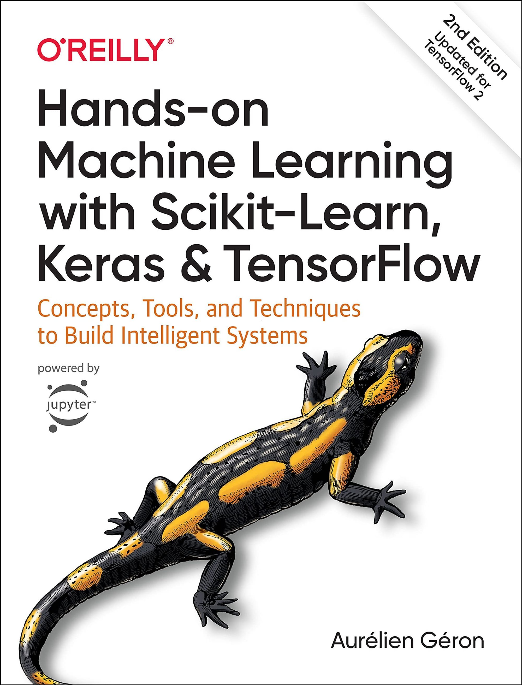

# Book: Hands-On Machine Learning with Scikit-Learn, Keras & TensorFlow

Code Practice from the Kaggle and the Book Hands-On Machine Learning

## Progress: 20% (4/19)

Chapter 1: Complete

- [x] Examples 
- [x] Exercices

Chapter 2: Complete

- [x] Examples 
- [x] Exercices

Chapter 3: Complete

- [x] Examples 
- [x] Exercices

Chapter 4: In Progress

- [x] Examples 
- [ ] Exercices

Chapter 5

- [ ] Examples 
- [ ] Exercices

Chapter 6

- [ ] Examples 
- [ ] Exercices

Chapter 7

- [ ] Examples 
- [ ] Exercices

Chapter 8

- [ ] Examples 
- [ ] Exercices

[⬆ Back to the top](#SaveIt:-Personal-Video-Logger) 

